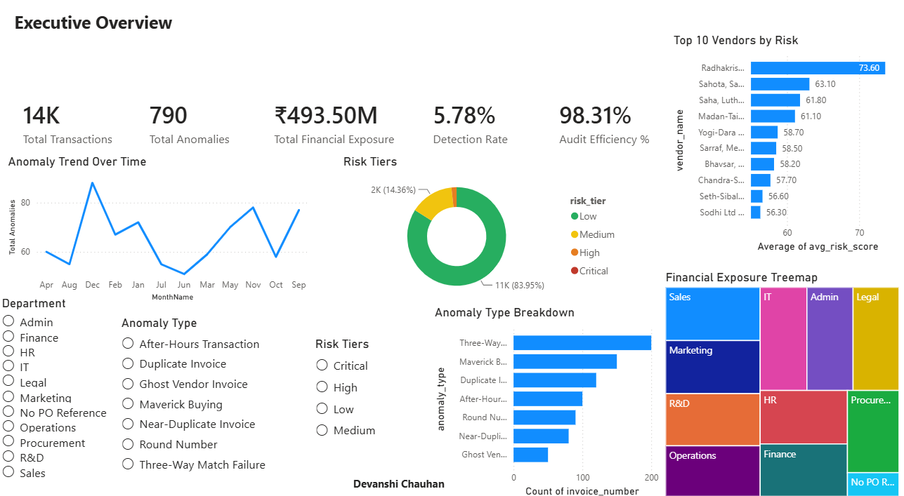
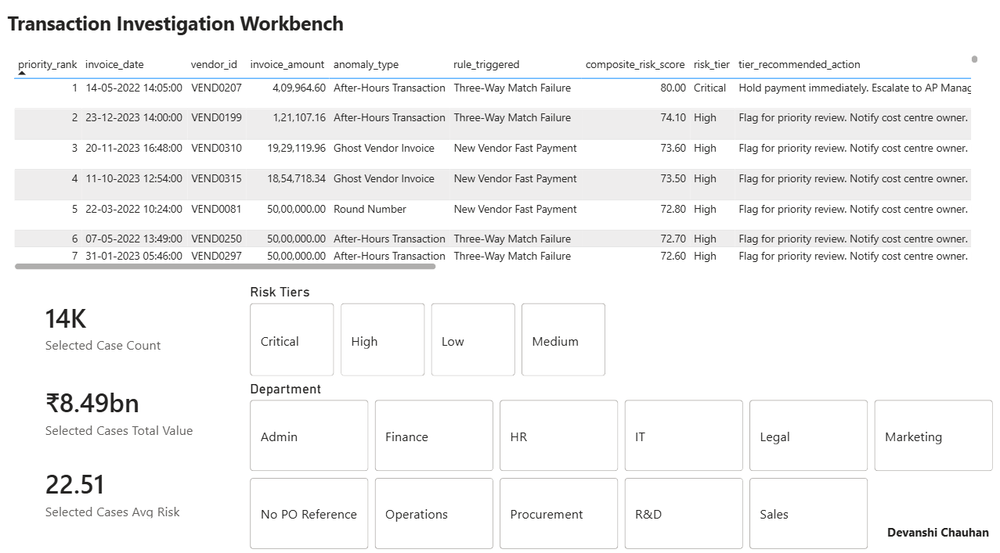
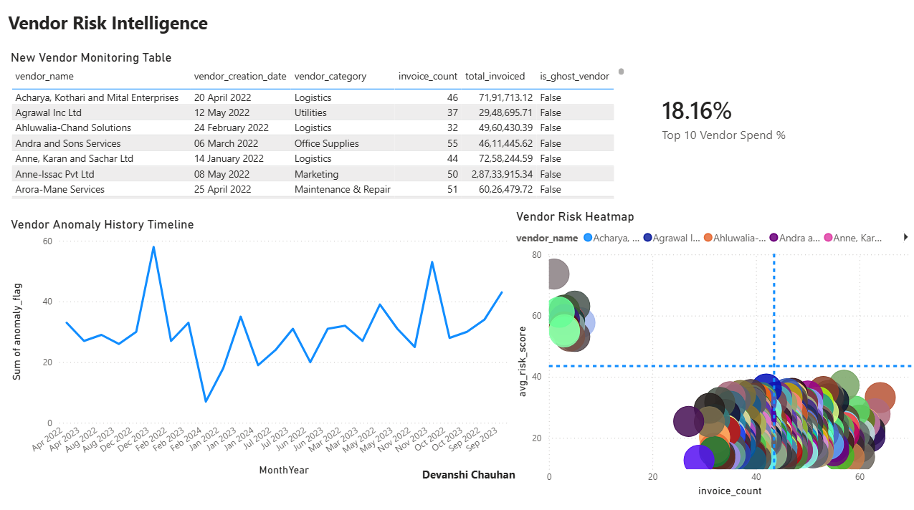
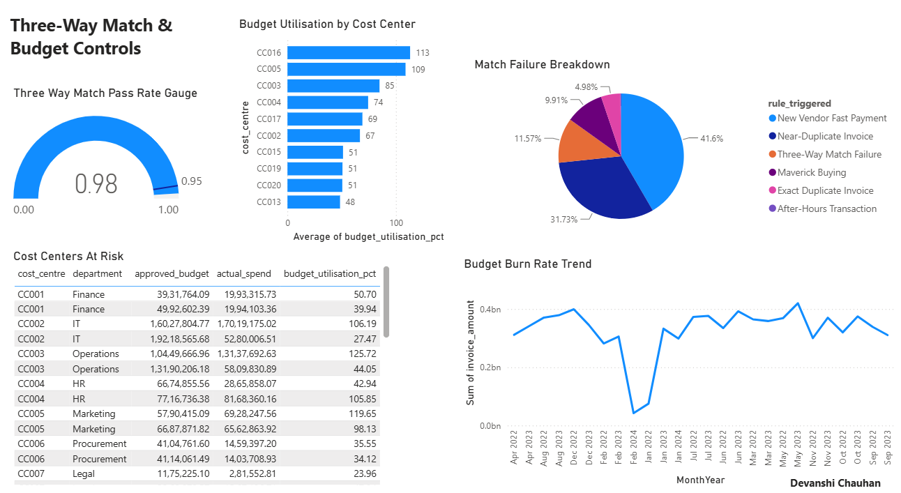
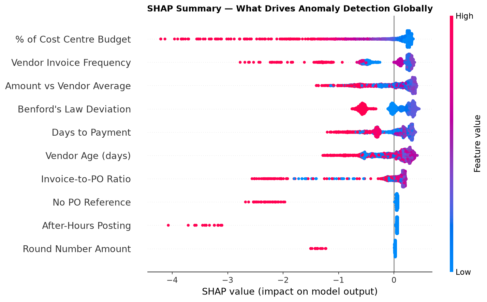
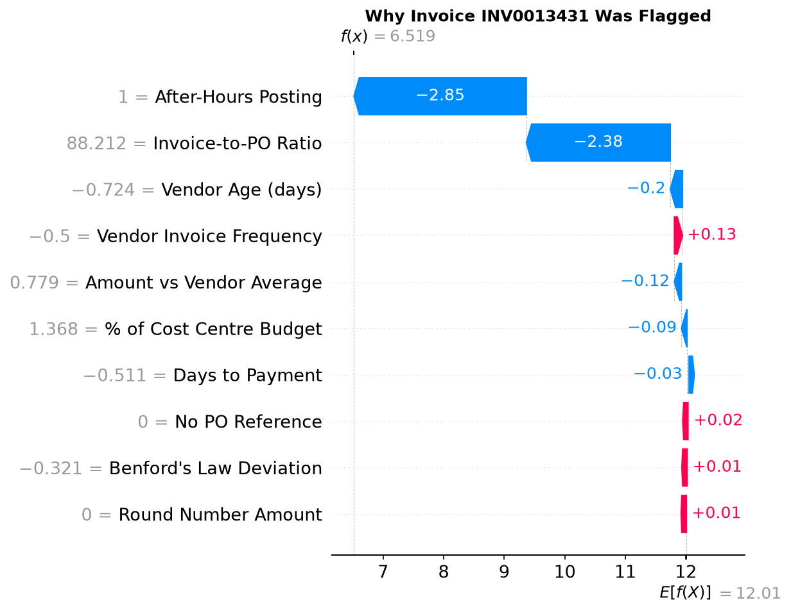
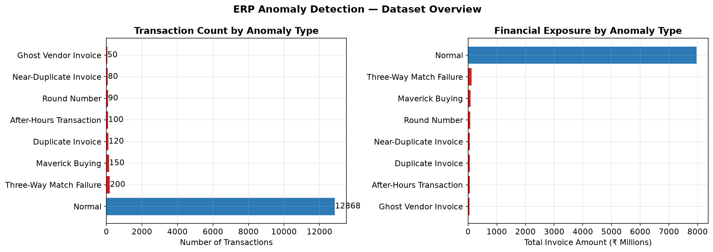
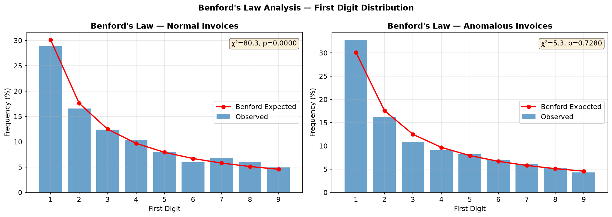

# AI-Powered ERP Anomaly Detection System
### Identifying Procurement Fraud and Financial Control Failures in SAP Transaction Data


---

## Business Context

Procurement fraud costs organisations an estimated **5% of annual revenue** (ACFE 
Report to the Nations, 2022). In large enterprises running SAP ERP, thousands of 
invoice transactions are processed monthly — far beyond the capacity of manual audit 
sampling. Traditional annual audits catch fraud months after it begins; continuous 
AI-powered monitoring changes this to real-time detection.

This project simulates a **forensic audit engagement** of the type delivered by Big 4 
firms (Deloitte, EY, PwC, KPMG) — building the complete detection pipeline from raw 
SAP transaction data through to an auditor-ready case management dashboard and 
structured audit report.

---

## Key Results

| Metric | Value |
|---|---|
| Transactions analysed | 13,658 |
| Anomalies detected | 790 (5.78% detection rate) |
| Financial exposure identified | ₹49.35 crore (₹493.5M) |
| Audit workload reduction | **98.3%** (AI auto-cleared low-risk transactions) |
| Three-way match pass rate | 98% (industry benchmark: 95%) |
| ML ensemble ROC-AUC | See model comparison chart |
| Risk tiers | 1 Critical · 230 High · 1,961 Medium · 11,466 Low |

---

## Anomaly Types Detected

| Fraud / Control Failure Type | Transactions | Description |
|---|---|---|
| Three-Way Match Failure | 200 | Invoice vs PO deviation >±5% |
| Maverick Buying | 150 | Invoices with no Purchase Order |
| Duplicate Invoice | 120 | Same vendor, same amount, same reference |
| After-Hours Transaction | 100 | Postings outside business hours |
| Round Number Invoice | 90 | Suspicious round-amount bias |
| Near-Duplicate Invoice | 80 | Amount tweaked by 0.5–2% to evade detection |
| Ghost Vendor Invoice | 50 | Vendor created and used within 22 days |
| Split Purchase Order | 150 POs | Multiple POs below approval threshold |

---

## Architecture

```
SAP P2P Data (6 tables, 47K+ records)
        ↓
PostgreSQL Database (DDL + referential integrity)
        ↓
    ┌─────────────────────────────────────┐
    │  Layer 1: Rule-Based Detection       │
    │  9 control rules → exceptions report │
    └─────────────────────────────────────┘
        ↓
    ┌─────────────────────────────────────┐
    │  Layer 2: ML Anomaly Detection       │
    │  Isolation Forest + Autoencoder      │
    │  → Ensemble anomaly score            │
    └─────────────────────────────────────┘
        ↓
    ┌─────────────────────────────────────┐
    │  Layer 3: Composite Risk Scoring     │
    │  0-100 score (ML 40% / Rules 35% /  │
    │  Value 25%) → Critical/High/Med/Low  │
    └─────────────────────────────────────┘
        ↓
    ┌──────────────┐    ┌────────────────┐
    │  Power BI    │    │ SHAP           │
    │  4-page      │    │ Explainability  │
    │  Dashboard   │    │ → Audit-ready  │
    │              │    │   explanations │
    └──────────────┘    └────────────────┘
        ↓
Structured Internal Audit Report (PDF)
Modelled on Big 4 forensic deliverable format
```

---

## Dashboard Preview

### Page 1 — Executive Risk Overview


### Page 2 — Investigation Workbench


### Page 3 — Vendor Risk Intelligence


### Page 4 — Match & Budget Controls


---

## SHAP Explainability

Every flagged transaction includes a machine-generated, auditor-readable explanation 
of which features drove the anomaly score — enabling findings to be acted on without 
a data science background.

### Global Feature Importance


### Single Transaction Explanation (Top Risk Case)


---

## Fraud Detection — EDA Highlights

### Anomaly Overview


### Benford's Law Analysis
Forensic accounting technique applied to detect unnatural digit distributions in 
invoice amounts — a recognised signal of fabricated or manipulated figures.



---

## Methodology

### Feature Engineering (10 features)
| Feature | Fraud Signal Captured |
|---|---|
| Amount z-score vs vendor average | Unusual invoice size for this vendor |
| Invoice-to-PO ratio | Price manipulation / overbilling |
| Vendor age at transaction date | Ghost vendor — new vendor used immediately |
| Days to payment | Unusually fast payment (collusion signal) |
| Vendor monthly invoice frequency | Billing abuse / high-frequency vendor |
| % of cost centre budget | Single invoice consuming outsized budget share |
| After-hours posting flag | Unauthorised access / concealment |
| No PO reference flag | Maverick buying |
| Round number indicator | Fabricated amount |
| Benford's Law deviation | Unnatural digit distribution |

### Models
- **Isolation Forest** — unsupervised tree ensemble, 200 estimators, 
  contamination=0.05. Anomalies isolated in fewer random splits = shorter path length.
- **Autoencoder** — Keras neural network (10→16→8→3→8→16→10), trained on 
  normal transactions only. High reconstruction error = anomaly.
- **Ensemble** — weighted combination (IF: 55%, AE: 45%) normalised to [0,1].

### Risk Scoring
```
Composite Score (0-100) =
    0.40 × ML Ensemble Score (normalised)
  + 0.35 × Rule-Based Severity Score (×10)
  + 0.25 × Log-Scaled Transaction Value (normalised)
```

---

## SAP Domain Mapping

This project replicates and extends the logic of **SAP GRC Process Control**:

| This Project | SAP GRC Equivalent | Key Difference |
|---|---|---|
| Rule-based detection engine | Automated Control Tests | GRC runs live via RFC; this runs on extracts |
| Ghost vendor detection | Vendor Master Monitoring | This adds ML scoring GRC lacks natively |
| Budget overrun alerts | CO Availability Control | GRC is preventive; this is detective |
| SHAP explanations | Audit Finding Documentation | GRC requires manual write-up; this auto-generates |
| Power BI dashboard | SAP Analytics Cloud / Fiori | GRC uses live data; this uses scored exports |

---

## Tech Stack

| Layer | Technology |
|---|---|
| Data Generation | Python, Faker, NumPy |
| Database | PostgreSQL 15, SQLAlchemy |
| EDA & Forensics | pandas, matplotlib, seaborn, scipy |
| ML Models | scikit-learn (Isolation Forest), TensorFlow/Keras (Autoencoder) |
| Explainability | SHAP (TreeExplainer) |
| Risk Scoring | Custom composite scoring engine |
| Dashboard | Power BI Desktop (May 2026) |
| Audit Report | ReportLab PDF generation |
| Version Control | Git / GitHub |

---

## Repository Structure

```
erp-anomaly-detection/
├── config.py                    # All thresholds and parameters
├── requirements.txt
├── src/
│   ├── generate_data.py         # Phase 2: synthetic SAP data generation
│   ├── verify_data.py           # Phase 2: anomaly injection verification
│   ├── db_setup.py              # Phase 3: PostgreSQL DDL
│   ├── load_data.py             # Phase 3: CSV → PostgreSQL loader
│   ├── audit_queries.py         # Phase 3: 7 SQL audit control tests
│   ├── phase4_eda.py            # Phase 4: fraud-focused EDA + Benford's Law
│   ├── phase5_rules.py          # Phase 5: 9-rule detection engine
│   ├── phase6_ml.py             # Phase 6: Isolation Forest + Autoencoder
│   ├── phase7_risk_scoring.py   # Phase 7: composite risk scoring
│   ├── phase9_shap.py           # Phase 9: SHAP explainability
│   └── phase10_audit_report.py  # Phase 10: PDF audit report generation
├── dashboard/
│   └── ERP_Anomaly_Detection_Dashboard.pbix
├── outputs/
│   ├── eda/                     # 8 EDA charts (PNG)
│   ├── rules/                   # master_exceptions_report.csv
│   ├── shap/                    # SHAP summary, bar, waterfall plots
│   └── report/                  # ERP_Anomaly_Detection_Audit_Report.pdf
└── docs/
    └── screenshots/             # Dashboard screenshots for README
```

---

## Setup Instructions

```bash
# 1. Clone the repository
git clone https://github.com/devanshiddc2608/erp-anomaly-detection
cd erp-anomaly-detection

# 2. Create virtual environment
python -m venv venv
source venv/bin/activate      # Mac/Linux
venv\Scripts\activate         # Windows

# 3. Install dependencies
pip install -r requirements.txt

# 4. Generate synthetic dataset
python src/generate_data.py

# 5. Verify anomaly injection
python src/verify_data.py

# 6. Set up PostgreSQL database (requires PostgreSQL 15+)
python src/db_setup.py
python src/load_data.py

# 7. Run audit SQL queries
python src/audit_queries.py

# 8. Run full detection pipeline
python src/phase4_eda.py
python src/phase5_rules.py
python src/phase6_ml.py
python src/phase7_risk_scoring.py
python src/phase9_shap.py
python src/phase10_audit_report.py

# 9. Open dashboard
# Load outputs/risk_scoring/powerbi_master_export.csv into
# dashboard/ERP_Anomaly_Detection_Dashboard.pbix
```

---

## Audit Report

A structured PDF internal audit report — modelled on Big 4 forensic deliverable 
format — is generated at `outputs/report/ERP_Anomaly_Detection_Audit_Report.pdf`.

It includes: Executive Summary with KPI strip · Detection Methodology · 
6 Detailed Findings (each with description, business impact, root cause hypothesis, 
and recommended action) · Overall Risk Rating · 10-item Management Action Plan.

---

*This project was built as a portfolio demonstration of ERP audit analytics, 
SAP process knowledge, and AI-augmented financial controls monitoring. 
All data is synthetically generated — no real organisational or personal 
data is used.*
